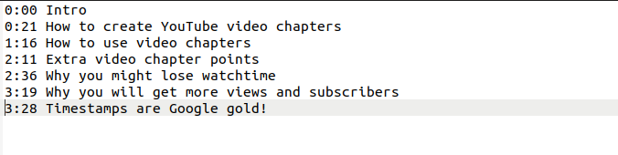

# chapter embedding

This mini project was a result of my own curiosity. I wanted the youtube timestamps features available for oflline
videos also but when you download videos from youtube they won't come pre-embeded.

So, i decided to do this.

If any issue occurs, i am more than happy to help you. Join [this](https://t.me/Chapters_embedding_public_group) telegram group for any kind of reporting or support.
  
# Requirments
1) [python3](https://www.python.org/downloads/)

    python-magic python module is required for file validation. use the bellow command to install it.

        pip3 install python-magic

2) [ffmpeg](https://ffmpeg.org/download.html)

    linux users can install it using default package manager.

        sudo apt install ffmpeg

    mac and windows users might need to download and setup ffmpeg from this [site](https://ffmpeg.org/download.html).
  
# Steps to perform

Git clone the repo to your machine, cd into the chapter-embedding directory and follow the bellow steps.

hope you already satisfy the requirements.

1. start the execution of [main.py](./main.py) through terminal as follows.

    

2. Enter the video file's path

    

3. Enter the timestamps text file's path. 
    
    Timestamps can be copied from youtube video description or can be created. They must be in the following shown format.

    

    

4. If everything goes fine you should end up with a chapters embeded video file in the directory of video's+output

    

  
# Final thoughts

Hope it was usefull in any way.
